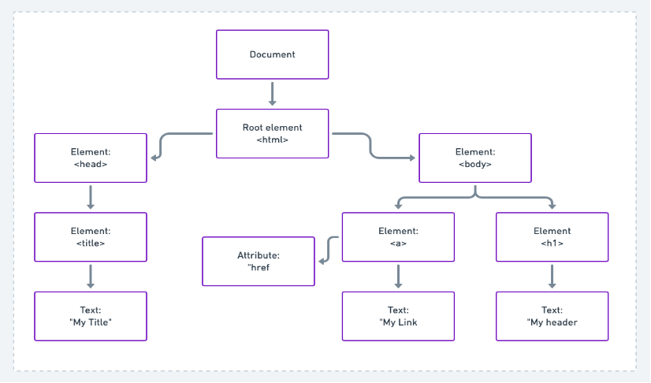

# Introdução

## O que é DOM?

DOM (Document Object Model) é como o browser do computador lê os elementos HTML e XML. Assim, ele cria uma representação estruturada do documento e define os meios pelos quais essa estrutura poderá ser acessada. Dessa forma, é possível criar páginas que atualizam os dados da mesma sem que seja necessário recarregá-la, além de permitir criação de elementos dinamicamente na página

## Árvore DOM

Para conseguir representar melhor o DOM normalmente é utilizado um diagrama de árvore onde dentro dele é traduzido todo o arquivo HTML de uma página e dentro do diagrama podemos utilizar 5 tipos de elementos para representar as partes do codigo

### Elementos

#### 1 - Document:

São todos os documentos contidos no HTML, ou seja, a página em si

#### 2 - Element:

Todas as tags do HTML ou do XML se transformam em elementos da árvore DOM

#### 3 - Root Element:

É o Element raiz de toda a árvore e que esta ligado diretamente ao Document

#### 4 - Text:

Todo o texto que vai entre as tags

#### 5 - Attribute:&#x20;

Atributos ou conjunto de atributos os quais se referem a um elemento

### Exemplo

Com isso podemos utilizar como exemplo o seguinte codigo em HTML:

<pre class="language-html"><code class="lang-html"><strong>&#x3C;!DOCTYPE html>
</strong>&#x3C;html>
    &#x3C;head>
        &#x3C;title>My Title&#x3C;/title>
    &#x3C;/head>
    
    &#x3C;body>
        &#x3C;a href="www.facebook.com">
            My Link
        &#x3C;/a>
        &#x3C;h1>
            My header
        &#x3C;/h1> 
    &#x3C;/body>
&#x3C;/html>
</code></pre>

Nesse caso podemos observar que o Root Element é o \<html> que esta englobando o codigo como um todo e dentro dele temos dois Elements que são o \<head> e o \<body> e que dentro deles existem diversos outros Elements.

Seguindo como exemplo podemos pegar o Element \<a> que esta dentro do \<body> e dentro dele ainda tem um Text que é o "My Link" e um Attribute que é o "href".

Com tudo isso em mente podemos pegar o codigo de cima e criar o diagrama que ficaria da seguinte forma:

<figure><figcaption></figcaption></figure>
