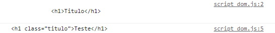

# Manipulando Conteúdos

## Propriedades dos elementos

Agora que já conseguimos selecionar os elementos que queremos modificar chegou a hora de aprender a como editar o seu conteudo atraves das suas propriedades e para explicar melhor cada propriedade todos os exemplos dados estarão em um arquivo chamado "script\_dom.js" e seguirão como referencia o seguinte HTML

```html
<!DOCTYPE html>
<html>
    <head>
        <title>Title</title>
    </head>

    <body>
        <section class="secao" >
            <h1>
                Titulo
            </h1>
        </section>
        <script src="script_dom.js"></script>
    </body>
</html>
```

### innerHTML

O innerHTML são todos os elementos de estilo e HTML que está dentro do elemento selecionado

Para exemplificar podemos selecionar a tag \<section> e irei dar um console.log do seu innerHTML

```javascript
let secao = document.querySelector("#secao")
console.log(secao.innerHTML)
```

E com isso nos teremos a seguinte resposta no nosso console

<figure><figcaption></figcaption></figure>

Além disso tambem conseguimos editar esta propriedade mudando assim o que é renderizado na pagina, para isso vamos acrescentar no exemplo de cima os seguintes codigos

```javascript
let secao = document.querySelector(".secao")
console.log(secao.innerHTML)

secao.innerHTML= "<h1 class='titulo'>Teste</h1>"
console.log(secao.innerHTML)
```

Logo nos teremos a seguinte resposta no nosso console onde é possivel notar a substituição do antigo innerHTML pelo novo que acabamos de definir

<figure><figcaption></figcaption></figure>

### innerText

Esta propriedade&#x20;

### textContent

### Atributos
