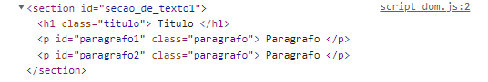

# Seleção de Elementos

O DOM é muito importante para a gente pois através do JavaScript conseguimos edita-lo conforme o usuario for navegando na página e dependendo das suas interações nos podemos utilizar o DOM para modificar o HTML da página e assim deixando ela mais dinâmica

Mas antes de editarmos algum elemento primeiro precisamos selecionar o que queremos modificar no nosso codigo e para isso nos temos diversas funções no JavaScript para nos ajudar

## Funções de seleção

Para conseguir manipular o DOM nos utilizamos um objeto do JavaScript chamado "document" e para explicar melhor cada função todos os exemplos dados estarão em um arquivo chamado "script\_dom.js" e seguirão como referencia o seguinte HTML

<pre class="language-html"><code class="lang-html">&#x3C;!DOCTYPE html>
&#x3C;html>
    &#x3C;head>
        &#x3C;title>Title&#x3C;/title>
    &#x3C;/head>

    &#x3C;body>
<strong>        &#x3C;section id="secao_de_texto1" >
</strong>            &#x3C;h1 class="titulo">
                Titulo
            &#x3C;/h1>
            &#x3C;p id="paragrafo1" class="paragrafo">
                Paragrafo
            &#x3C;/p>
            &#x3C;p id="paragrafo2" class="paragrafo">
                Paragrafo
            &#x3C;/p>
        &#x3C;/section>
        &#x3C;script src="script_dom.js">&#x3C;/script>
    &#x3C;/body>
&#x3C;/html>
</code></pre>

### getElementsById

Esta função serve para buscar um elemento atraves do seu id e retornando o primeiro que ele encontrar

Para exemplificar podemos buscar a tag \<section> atraves do seu id "secao\_de\_texto1" e dar um console.log nele

```javascript
let secao1 = document.getElementById("secao_de_texto1")
console.log(secao1)
```

E com isso nos teremos a seguinte resposta no nosso console

<figure><figcaption></figcaption></figure>

### getElementsByClassName

Já esta função serve para buscar mais de um elemento atraves da sua class e ele retorna um [HTMLCollection](https://developer.mozilla.org/pt-BR/docs/Web/API/HTMLCollection) que é um tipo de array com todos os elementos na ordem que foram encontrados

Para exemplificar podemos buscar as tags \<p> atraves da sua class "paragrafo" e dar um console.log

```javascript
let paragrafos = document.getElementsByClassName("paragrafo")
console.log(paragrafos)
```

E com isso nos teremos a seguinte resposta no nosso console

<figure><figcaption></figcaption></figure>

### querySelector

O querySelector é uma função mais genérica e com ela conseguimos buscar tanto pelo id quanto pela class e retornando sempre o primeiro elemento que for encontrado

Para conseguirmos diferenciar nos colocamos . no inicio do nosso parametro de busca quando queremos buscar uma classe e # quando queremos buscar um id

Para exemplificar podemos buscar a tag \<section> atraves do seu id e a primeira tag \<p> atraves da sua class e dar um console.log em ambos

```javascript
let secao = document.querySelector("#secao_de_texto1")
console.log(secao)

let paragrafo = document.querySelector(".paragrafo")
console.log(paragrafo)
```

E com isso nos teremos a seguinte resposta no nosso console

<figure><figcaption></figcaption></figure>

### querySelectorAll

Esta função é identica a função de cima, porém ela retorna todos os elementos que encontrar diferente do querySelector que para no primeiro. Para isso ela coloca todos os elementos que ela encontra em uma especie de objeto chamado [NodeList](https://developer.mozilla.org/pt-BR/docs/Web/API/NodeList) e na mesma ordem que esta no HTML

Para exemplificar podemos buscar as tags \<p> atraves da sua class "paragrafo" e dar um console.log

```javascript
let todos_paragrafos = document.querySelectorAll(".paragrafo")
console.log(todos_paragrafos)
```

E com isso nos teremos a seguinte resposta no nosso console

<figure><figcaption></figcaption></figure>

## Encerramento e codigos finais

Com tudo isso nos ja conseguimos selecionar os elementos que precisamos e podemos passar para o proximo passo que é edita-los


```html
<!DOCTYPE html>
<html>
    <head>
        <title>Title</title>
    </head>

    <body>
        <section id="secao_de_texto1" >
            <h1 class="titulo">
                Titulo
            </h1>
            <p id="paragrafo1" class="paragrafo">
                Paragrafo1
            </p>
            <p id="paragrafo2" class="paragrafo">
                Paragrafo2
            </p>
        </section>
        <script src="script_dom.js"></script>
    </body>
</html>
```



```javascript
let secao1 = document.getElementById("secao_de_texto1")
console.log(secao1)

let paragrafos = document.getElementsByClassName("paragrafo")
console.log(paragrafos)

let secao = document.querySelector("#secao_de_texto1")
console.log(secao)

let paragrafo = document.querySelector(".paragrafo")
console.log(paragrafo)

let todos_paragrafos = document.querySelectorAll(".paragrafo")
console.log(todos_paragrafos)
```

